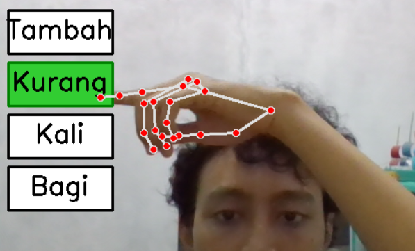
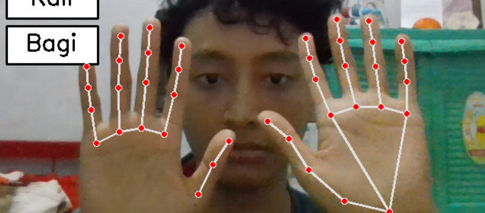
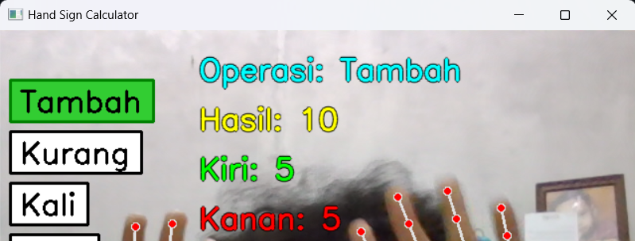

# Hand Sign Calculator  
Proyek **Hand Sign Calculator** adalah filter berbasis Python yang memungkinkan pengguna untuk melakukan operasi matematika sederhana dengan menggunakan gestur tangan sebagai input. Aplikasi ini memanfaatkan teknologi Mediapipe untuk mendeteksi simbol tangan dan memilih operasi matematika seperti penjumlahan, pengurangan, perkalian, dan pembagian.  

## Fitur Utama  
- Deteksi gestur angka menggunakan landmark tangan dari Mediapipe.  
- Pemilihan operasi matematika (+, -, *, /) melalui gestur jari.  
- Tampilan hasil secara real-time pada layar webcam.  
- Setiap interaksi memiliki efek suara yang berbeda

---

## Anggota Tim  


- **Nama Lengkap**: Made Redy Wijaya  
  **NIM**: 121140157  
  **GitHub**: [redywi](https://github.com/redywi)


- **Nama Lengkap**: Farhan Apri Kesuma  
  **NIM**: 121140179  
  **GitHub**: [parhannn](https://github.com/parhannn)


- **Nama Lengkap**: Carlos Piero Parhusip  
  **NIM**: 121140193  
  **GitHub**: [gyoro2](https://github.com/gyoro2)  


---

## Logbook Progress  
| **Minggu** | **Tanggal**   | **Progress**                                                                                  |  
|------------|---------------|----------------------------------------------------------------------------------------------|  
| 1          | [21/11/2024]     | - Inisialisasi proyek, eksplorasi Mediapipe, studi dokumentasi API Hand Landmarker, implementasi deteksi landmark tangan dan penentuan simbol angka menggunakan Mediapipe, pengintegrasian logika operasi matematika dan debugging hasil kalkulasi.      |  
| 2          | [21/11/2024]     | - Menambahkan UI interaktif pada tampilan webcam untuk memilih, finalisasi program, dokumentasi proyek, dan README.md.                     | 
| 3          | [13/12/2024]     | - Menambahkan efek suara untuk setiap interaksi. Yaitu dalam memilih operasi hitung, hasil operasi hitung dan juga error.                    |
| 3          | [13/12/2024]     | - Memperbaiki UI lama menjadi lebih user-friendly.                    |


---

## Instruksi Instalasi dan Penggunaan  

### 1. Prasyarat  
Pastikan Anda sudah menginstal **Python 3.8** atau versi lebih baru di sistem Anda.  

### 2. Instalasi  
1. Clone repositori ini ke komputer Anda:  
   ```bash  
   git clone https://github.com/redywi/hand-sign-calculator.git  
   cd hand-sign-calculator
    ```
1. Instal dependensi menggunakan requirements.txt:  
   ```bash  
   pip install -r requirements.txt  
    ```
### 3. Menjalankan Program
1. Jalankan file utama menggunakan Python:  
   ```bash  
    python main.py 
    ```
2. Arahkan tangan Anda ke kamera untuk mendeteksi simbol angka atau memilih operasi.

### 4. Penggunaan Gestur
- Gestur Angka (0-5): Gunakan satu tangan untuk menunjukkan angka yang ingin dimasukkan.
- Memilih Operasi: Arahkan jari telunjuk ke simbol operasi yang ditampilkan di layar (tambah, kurang, kali, bagi).
- Hasil: Hasil perhitungan akan ditampilkan secara real-time di layar.

---

## Contoh Tampilan Program
Tampilan layar program akan menunjukkan:
### 1. Menu Operasi: Daftar operasi matematika di sisi kiri atas layar.



### 2. Deteksi Angka: Angka dari tangan kiri dan kanan yang terdeteksi.



### 3. Hasil Perhitungan: Ditampilkan di bagian tengah layar.



---

## Kontribusi
Kami terbuka untuk masukan dan kontribusi lebih lanjut. Jika ingin berkontribusi, silakan buat pull request atau ajukan issue pada repositori ini.